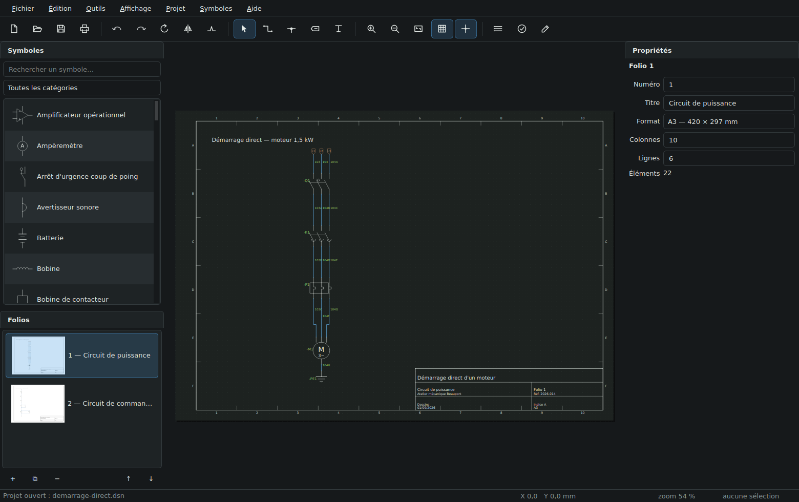
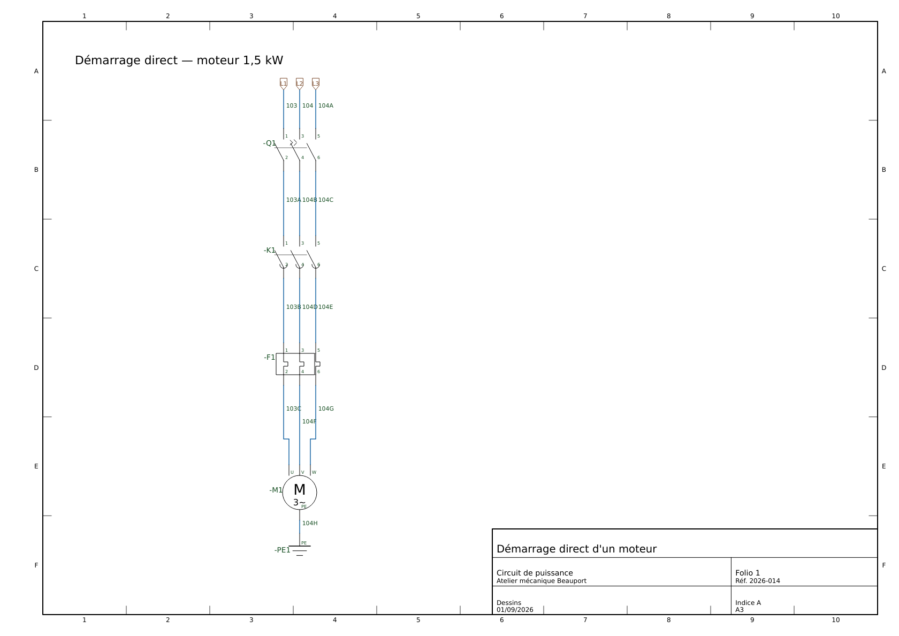
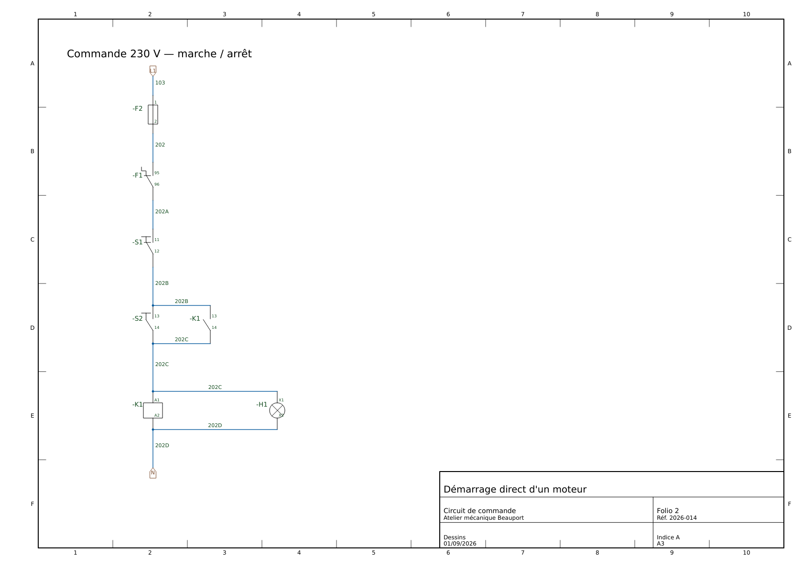
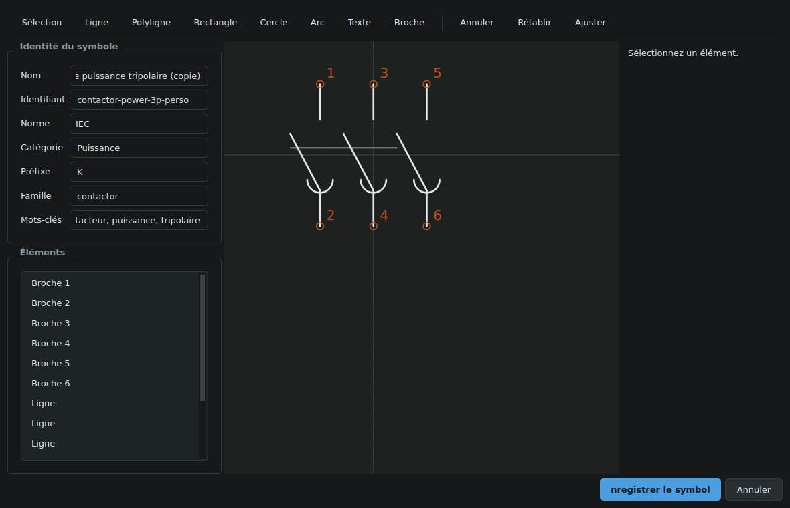

# Dessins

Logiciel de dessin électrique — schémas de commande et de puissance,
unifilaires de distribution, circuits électroniques. Application de bureau
native, Qt 6 et C++20.



## Télécharger

Les versions publiées sont sur la page
[**Releases**](https://github.com/plguy9/dessins/releases) : un `.zip`
Windows à décompresser, puis double-cliquer `dessins.exe` — Qt est embarqué,
rien d'autre à installer. Le binaire n'étant pas signé, Windows affiche un
avertissement SmartScreen au premier lancement : *Informations
complémentaires → Exécuter quand même*.

## Où en est le projet

| Jalon | État | Contenu |
|---|---|---|
| **M0** Socle | ✅ | Cœur sans GUI : géométrie en millimètres, modèle de document, extraction des potentiels, pile d'annulation |
| **M1** Canevas | ✅ | Grille, zoom, panoramique, sélection, accrochage aux broches, cadre et cartouche |
| **M2** Symboles | ✅ | 103 symboles CEI et ANSI intégrés, palette, **éditeur de symboles** |
| **M3** Connectivité | ✅ | Fils orthogonaux, jonctions, **liaisons multi-conducteurs**, étiquettes de potentiel, renvois de folio |
| **M4** Automatismes | ✅ | Repérage des fils, désignation des appareils, nomenclature, bornier, liste des fils |
| **M5** Sortie | ✅ | Impression et export PDF multi-folios |
| **M6** Interopérabilité | ✅ | Export DXF R12, un fichier par folio |
| **M7** Profil ANSI | ✅ | 41 symboles ANSI, repérage nord-américain, formats et unités impériales, commutation par projet |
| **M8** Unifilaires | ◐ | Le modèle multi-conducteurs est en place ; symboles et bilan de puissance à faire |
| **M9** Électronique | ◐ | Symboles en place ; export de netlist SPICE / KiCad à faire |

Le [brief d'architecture](docs/BRIEF.md) explique les décisions et ce qui a été
volontairement écarté.

## Ce que le logiciel fait aujourd'hui

- **Dessiner** un schéma : poser des symboles (`R` pour pivoter, `M` pour
  retourner), tracer des fils orthogonaux, poser des jonctions, nommer des
  potentiels, annoter.
- **Comprendre** ce qui est dessiné : les potentiels sont extraits du tracé,
  pas saisis. Deux fils qui se croisent sans jonction ne sont pas connectés ;
  une extrémité posée au milieu d'un autre fil l'est.
- **Repérer automatiquement** : désignation des appareils dans l'ordre de
  lecture (`-K1`, `-Q2`), repères de fil par folio et colonne. Ce qui a été
  saisi à la main n'est jamais écrasé.
- **Traverser les folios** : un renvoi de folio relie le même potentiel d'un
  bout à l'autre du dossier. Un appareil multi-blocs — un contacteur, sa bobine,
  ses contacts auxiliaires — porte une seule désignation et ne compte qu'une
  fois dans la nomenclature.
- **Produire le dossier** : PDF multi-folios, impression, DXF, nomenclature et
  liste des fils en CSV.
- **Étendre la bibliothèque** : l'éditeur de symboles intégré dessine, place et
  type les broches, et enregistre dans la bibliothèque de l'utilisateur.

## Compiler

Il faut Qt 6.2 ou plus, CMake 3.21, un compilateur C++20 et zlib. Catch2 3 est
facultatif — sans lui, la suite de tests est simplement désactivée.

```sh
# Debian / Ubuntu
sudo apt install qt6-base-dev qt6-svg-dev libgl1-mesa-dev cmake ninja-build zlib1g-dev catch2

cmake -S . -B build -G Ninja -DCMAKE_BUILD_TYPE=Release
cmake --build build
ctest --test-dir build --output-on-failure

./build/bin/dessins                       # l'application
./build/bin/dessins_sample examples       # régénère le projet d'exemple
```

Options : `-DDESSINS_BUILD_GUI=OFF` compile le cœur seul (utile en intégration
continue sans Qt Widgets), `-DDESSINS_BUILD_TESTS=OFF` retire les tests.

## Le projet d'exemple

`./build/bin/dessins_sample examples` produit un démarrage direct de moteur en
deux folios, puis exporte le tout. C'est aussi une vérification de bout en
bout : bibliothèque, connectivité, repérage, rapports, rendu et les trois
formats de sortie en une seule passe.

| Folio 1 — puissance | Folio 2 — commande |
|---|---|
|  |  |

Tout ce qui est visible est calculé : le cadre et ses zones, le cartouche
rempli depuis les données du projet, les repères de fil (103, 104A, 202B…) et
les désignations (`-Q1`, `-K1`, `-F1`). Sur le folio 2, `-K1` désigne le même
contacteur que sur le folio 1.

## L'éditeur de symboles



La bibliothèque est le vrai coût d'un logiciel de ce type : des centaines de
symboles à dessiner et à vérifier, et c'est régulièrement ce qui enlise le
projet — le moteur marche, mais il n'y a rien à poser dessus. L'éditeur arrive
donc tôt plutôt qu'en fin de parcours.

Un symbole intégré est **dupliqué** plutôt que modifié en place : la
bibliothèque livrée doit rester reproductible d'une version à l'autre. Les
symboles de l'utilisateur vont dans son dossier de données et remplacent ceux
d'origine s'ils partagent leur identifiant.

## Structure

```
src/core/      modèle, géométrie, connectivité, annulation — sans GUI
src/symbols/   chargement des bibliothèques depuis le disque
src/rules/     profils métier, repérage, rapports
src/render/    peintre de folio, PDF, rendu bitmap
src/io/        format natif .dsn, DXF, CSV
src/ui/        thème, canevas, panneaux, éditeur de symboles
src/app/       point d'entrée
libraries/     symboles CEI et ANSI (données, pas du code)
tools/         générateur de bibliothèque, projet d'exemple
tests/         Catch2 — cœur sans écran, et interface en « offscreen »
```

Chaque couche ne connaît que celles situées sous elle. `core/` ne référence que
`Qt6::Core` : il se teste sans écran et se réutilise tel quel pour un futur
outil en ligne de commande.

## Formats

- **`.dsn`** — format natif : un conteneur ZIP contenant du JSON, le projet et
  sa bibliothèque de symboles embarquée. Voir [docs/FORMAT.md](docs/FORMAT.md).
- **PDF** — le dossier complet, un folio par page, produit par le même code de
  peinture que l'écran.
- **DXF R12** — un fichier par folio, calques séparés pour les fils, les
  symboles et les repères. Le DXF transporte la géométrie, pas la connectivité.
- **CSV** — nomenclature, bornier, liste des fils, avec le séparateur et la
  marque d'octets attendus par le tableur local.

## Licence

À décider — voir les questions ouvertes du [brief](docs/BRIEF.md#9-questions-ouvertes).
Qt 6 sous LGPLv3 autorise la liaison dynamique dans un logiciel libre comme
propriétaire ; ce choix conditionne les bibliothèques tierces et les fonds de
symboles réutilisables.
